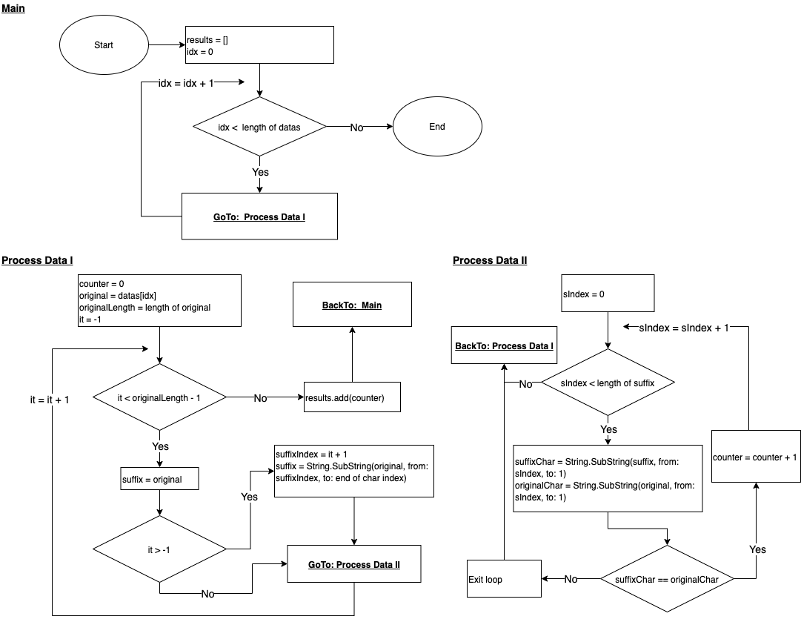

# What is the total count of string similarities based on it's suffixes?

## 1. Problem

Given a sample string `abcabc`. Every possibility of the suffixes that we can have will resulting [`abcabc`, `bcabc`, `cabc`, `abc`, `bc`, `c`] and then compare it (per each character) with the original `abcabc` we will get `[6 + 0 + 0 + 3 + 0 + 0] = 9` in total.

<br>

Please calculate total count of the similarities of each string based on it's suffixes `["bcaabcbca", "ddcabaddcb", "rtortortop", "cakikicaci"]`.

Expected Result: `[14, 15, 19, 13]`

```
### Credit To ###
Hackerrank
```

<br>

```
DISCLAIMER:

Everyone might have different way to analyze and solve this problem.

The Analytic and Solution below are my way to solve the issue. So there's no right or wrong if you have different way.

~ Coding is the Art of Thinking. Learn and Respect of Diversity.
```

<br>

## 2. Analytic

From the section 1, we learnt:

- Point 1: From explanation of the sample `ababc`, we learnt to pick every possibility of the suffix of that sample such as:
    - without prefix then the suffix is `abcbac`
    - pick prefix `a` then the suffix `bcabc`
    - pick prefix `ab` then the suffix `cabc`
    - pick prefix `abc` then the suffix `abc`
    - pick prefix `abca` then the suffix `bc`
    - pick prefix `abcab` then the suffix `c`
- Point 2: Then we try to compare each suffix with the original `abcabc`. We got:
    - `abcabc` vs `abcabc`, we got 6 similarities per each character.
    - `abcabc` vs `bcabc`, we got 0 similarity per each character. 
    ```
    Huh 0? Why? we have to ensure all character from our suffix are similar to the original and not just some of it.
    ```
    - `abcabc` vs `cabc`, we got 0 similarity per each character.
    - `abcabc` vs `abc`, we got 3 similarities per each character.
    - `abcabc` vs `bc`, we got 0 similarity per each character.
    - `abcabc` vs `c`, we got 0 similarity per each character.


## 3. Implementation

### 3.1 Pseudocode

Below is the Pseudocode to solve the problem:

```
Function GetCountSimilarties (datas)
    Set results = []

    Loop idx = 0 to length of datas -1 increment by 1
        Set counter = 0
        Set original = datas[idx]
        Set originalLength = length of original

        // Loop start from `-1` to simulate we are not taking any prefix yet
        // Loop until `originalLength - 2` since we are taking suffix from currentIndex + 1 for each iteration

        Loop it = -1 to originalLength -2 increment by 1
            Set suffix = original
            Check it > -1 then
                Set suffix = Call Lib of String.SubString(original, from: idx+1, to: endOfStringIndex)
            End Check

            Loop sIndex = 0 to length of suffix - 1 increment by 1
                Set suffixChar = Call Lib of String.SubString(suffix, sIndex, 1)
                set originalChar = Call Lib of String.SubString(original, sIndex, 1)

                Check suffixChar == originalChar then
                    Set counter = counter + 1
                Else
                    Exit loop
                End Check
            End Loop
        End Loop

        Set results.add(counter)
    End Loop

    return results
End Function
```

### 3.2 Flowchart

Below is the flowchart to solve this problem:



<br>

# License

[MIT](../LICENSE)

<br>

# Love it and want to buy me a coffee?

[](https://www.buymeacoffee.com/bayunugraha)
