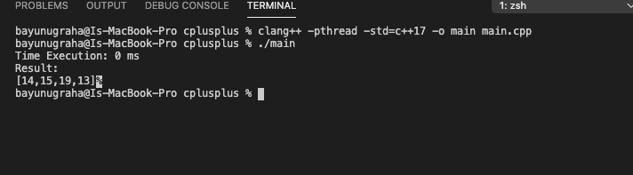

# Requirement

- [Clang](https://clang.llvm.org/get_started.html)
- [Visual Studio Code](https://code.visualstudio.com/download)

 

# Installation

- Install Clang from link above
- Install IDE Vs Code or other
- Terminal Way:
  - run `clang++ -pthread -std=c++17 -o main main.cpp`
  - run `./main`

 

# Sample Result

 

# License

[MIT](../../LICENSE)

 

# Love it and want to buy me a coffee?

