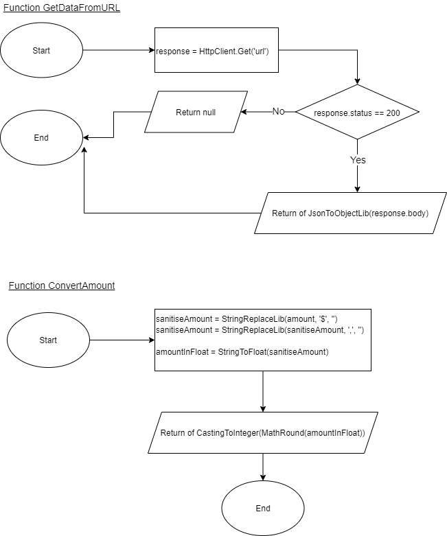

# What is the total amount?

## 1. Problem

Given URL API `https://jsonmock.hackerrank.com/api/transactions`. As Software Engineer please creates code implementation to retrieve `ALL TOTAL AMOUNT` for the following requirement:

- User Id is 2
- Location Id is 8
- Range of The First Subset IP is between 5 and 50

Example: Given IP `72.200.10.158`, So the first subset would be `72` and It is out of range between `5` and `50`.

Expected Result : `Total Amount: 8446`

```
### Credit To ###
Hackerrank
```

<br>

```
DISCLAIMER:

Everyone might have different way to analyze and solve this problem.

The Analytic and Solution below are my way to solve the issue. So there's no right or wrong if you have different way.

~ Coding is the Art of Thinking. Learn and Respect of Diversity.
```

<br>

## 2. Analytic

From the section 1, we learnt:

- Point 1: After tried to hit the API by using POSTMAN, I got several structure such as: Page, Per_Page, Total, Total_Pages and Collections of Data (see the result below).
  
  The output data will consists `10 datas` including `the number of page` that we are trying to access per hit API. `It means we have to loop all page in order to get all Total Amount`.
- Point 2: From the point above we knew that data collections consists of several user id, so I tried to explore whether I can filter based on the User Id per hit API or not? then `YES`, we can by adding query string `?userId=[number]` (see the result below).
  
  Unfortunately, we could not filter `locationId` from query string which is fine.
- Point 3: Since we have to compare range of the first subset IP, it means we have to create functionality like split the IP with delimeter `.` into array. So the expected result would be `ips = ['72', '200', '10', '158']` and we just access the first index data like `targetIP = ips[0]`.
- Point 4: As you can see from point 1 or 2, that the amount value is in `string amount with currency format`. So, we need to create functionality to convert that amount into float before able to sum it with another amount. Example: `$1,2563.25` needs to remove `$` and maybe including with removing `,` and then convert it from string to float `12563.25`.

## 3. Implementation

### 3.1 Pseudocode

Below is the Pseudocode to solve the problem:

```
Function GetDataFromURL (userId, page)
    Set response = Call HttpClient Lib to access of GET URL API 'https://jsonmock.hackerrank.com/api/transactions?userId=' + userId + '&page=' + page

    Check response.status = 200 (OK) Then
        return Call JSON to Object Conversion Lib from response.body
    End Check

    return null
End Function

Function ConvertAmount(amount)
    Set sanitiseAmount = Call String Replace of amount by replacing '$' to ''
    Set sanitiseAmount = Call String Replace of sanitiseAmount by replacing ',' to ''

    Set amountInFloat = Call String to Float Lib for sanitiseAmount
    return Call Casting to Integer and Math Round with 0 precision of amountInFloat

End Function

Function CalculateAmount(datas, locationId, netStart, netEnd)
    Set total = 0

    Loop idx = 0 to (length of datas) -1 increment by 1
        Check locationId == datas[idx].location.id then
            Set ips = Call String Split of datas[idx].ip by '.'
            Set firstData = Call String to Integer of ips[0]

            Check firstData >= netStart and firstData <= netEnd then
                total += ConvertAmount(datas[idx].amount)
            End Check
        End Check
    return total
End Function

Function GetTransaction(userId, locationId, netStart, netEnd)
    Set resp = GetDataFromURL(userId, 1)
    Set total = 0

    Check resp.total > 0 then
        total = CalculateAmount(resp.data, locationId, netStart, netEnd)
    End Check

    Check resp.total_pages > 1 then
        Loop page = 2 to resp.total_pages increment by 1
            Set resp = GetDataFromURL(userId, page)

            Check resp.total > 0 then
                total += CalculateAmount(resp.data, locationId, netStart, netEnd)
            End Check
        End Check
    End Check

    return total
End Function
```

### 3.2 Flowchart

Below is the flowchart to solve this problem:




<br>

# License

[MIT](../LICENSE)

<br>

# Love it and want to buy me a coffee?

[](https://www.buymeacoffee.com/bayunugraha)
