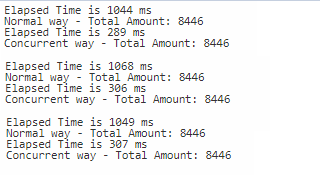

# Requirement

- [Microsoft .Net 5](https://dotnet.microsoft.com/download/dotnet/5.0)
- [Visual Studio Code](https://code.visualstudio.com/download) OR
- [Visual Studio Community Edition](https://visualstudio.microsoft.com/vs/community/)

## Libs

- Newtonsoft.Json

 

# Installation

- Install .Net 5 from link above
- Install IDE (Vs Code or Vs Community)
- Terminal Way:
  - run `dotnet restore`
  - run `dotnet run`
- Visual Studio:
  - Click run menu

 

# Sample Result

