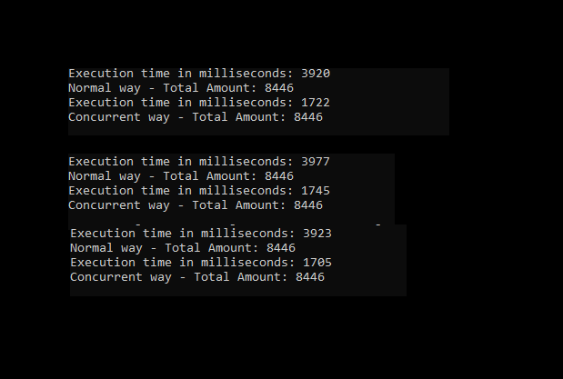

# Requirement

- [Java JDK-1.8 above](https://www.oracle.com/java/technologies/javase/javase-jdk8-downloads.html)
- [Intellij IDEA](https://www.jetbrains.com/idea/download/#section=windows)

 

# Installation

- Install Java JDK 1.8 from link above
- Install IDE Intellij IDEA or other
- Open Project from Intellij and click run

 

# Sample Result

 

# License

[MIT](../../LICENSE)

 

# Love it and want to buy me a coffee?

