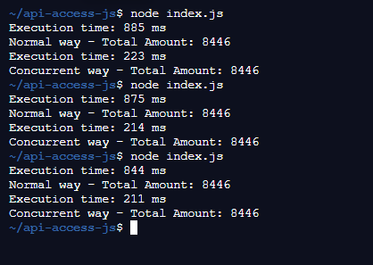

# Requirement

- [NodeJs](https://nodejs.org/en/)
- [Visual Studio Code](https://code.visualstudio.com/download)

## Libs

- axios

 

# Installation

- Install NodeJs from link above
- Install IDE Vs Code or other
- Terminal Way:
  - run `npm install` or `yarn install`
  - run `node main.js`

 

# Sample Result

 

# License

[MIT](../../LICENSE)

 

# Love it and want to buy me a coffee?

