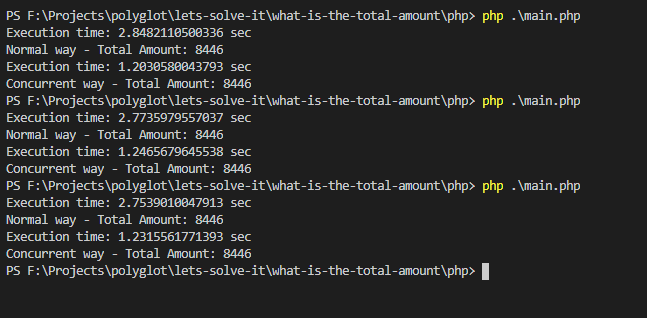

# Requirement

- [PHP](https://www.php.net/) or
- [Xampp](https://www.apachefriends.org/index.html)
- [Composer](https://getcomposer.org/download/)
- [Visual Studio Code](https://code.visualstudio.com/download)

## Libs

- guzzlehttp/guzzle

 

# Installation

- Install PHP or Xampp from link above
- Install Composer from link above
- Install IDE Vs Code or other
- Terminal Way:
  - run `composer install`
  - run `php main.php`

 

# Sample Result

 

# License

[MIT](../../LICENSE)

 

# Love it and want to buy me a coffee?

