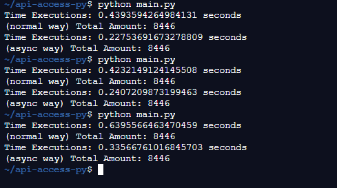

# Requirement

- [Python 3.9](https://www.python.org/)
- [Visual Studio Code](https://code.visualstudio.com/download)

## Libs

- aiohttp
- requests

 

# Installation

- Install Python from link above
- Install IDE Vs Code or other
- Terminal Way:
  - run `pip install -r requirements.txt`
  - run `python main.py`

 

# Sample Result

 

# License

[MIT](../../LICENSE)

 

# Love it and want to buy me a coffee?

